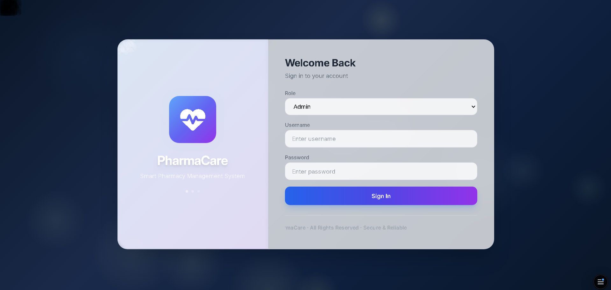
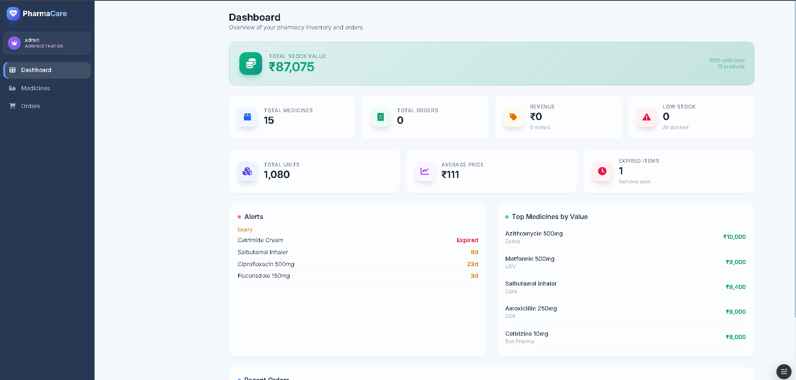
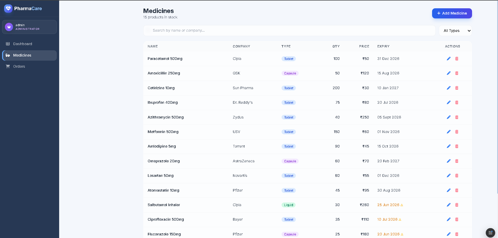
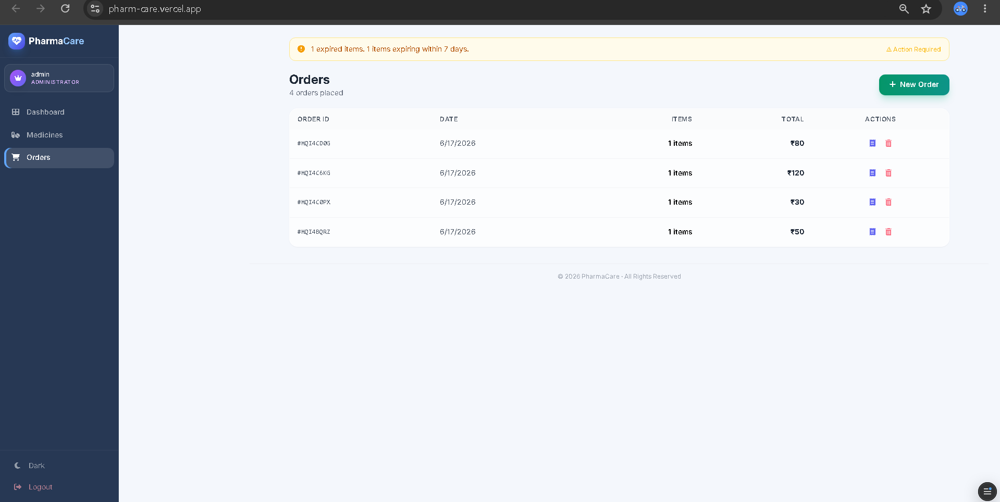

# 💊 PharmaCare – Pharmacy Management System

> A modern, fully responsive pharmacy management system built with **React** – streamlining inventory, orders, and stock monitoring with a stunning glass‑morphism UI.

---

## 📌 Table of Contents

- [Overview](#-overview)
- [Live Demo](#-live-demo)
- [Features](#-features)
- [Tech Stack](#-tech-stack)
- [Screenshots](#-screenshots)
- [Quick Start](#-quick-start)
- [Project Structure](#-project-structure)
- [Login Credentials](#-login-credentials)
- [Installation & Setup](#-installation--setup)
- [Deployment](#-deployment)
- [What Makes It Unique](#-what-makes-it-unique)
- [Future Enhancements](#-future-enhancements)
- [Contributing](#-contributing)
- [License](#-license)
- [Contact](#-contact)

---

## 📖 Overview

**PharmaCare** is a complete, browser‑based pharmacy management solution. It enables pharmacy staff and administrators to:

- ✅ Manage medicine inventory (add, edit, delete, search, filter)
- ✅ Process customer orders with real‑time stock deduction
- ✅ Track total stock value, revenue, low‑stock items, and expiry alerts
- ✅ Generate printable receipts for orders
- ✅ Toggle between light and dark modes

All data is stored locally in your browser using **localStorage** – no server, no database, no setup required.

---

## 🌐 Live Demo

> 🔗 **Live URL:** [https://pharm-care.vercel.app/](https://pharm-care.vercel.app/)

---

## ✨ Features

| Feature | Description |
|---------|-------------|
| 🔐 **Role‑based Login** | Admin (full CRUD) and Staff (view & order only) |
| 📊 **Smart Dashboard** | Total stock value, revenue, orders, low‑stock & expiry alerts, top medicines, recent orders |
| 💊 **Inventory Management** | Add, edit, delete, search, and filter by type (Tablet, Capsule, Liquid, Cream) |
| 🛒 **Order Processing** | Create orders, auto‑deduct stock, print receipts |
| 🌙 **Dark/Light Mode** | Toggle theme for comfortable viewing |
| 💾 **Persistent Storage** | All data saved in browser localStorage – no backend needed |
| 📱 **Fully Responsive** | Works on desktop, tablet, and mobile |
| 🧊 **Glass‑morphism UI** | Premium visual design with floating medical icons and smooth animations |

---

## 🛠️ Tech Stack

| Layer | Technology |
|-------|------------|
| **Frontend** | React 18 (functional components, hooks, Context API) |
| **Styling** | Tailwind CSS + Custom CSS (glass‑morphism, animations) |
| **Icons** | Font Awesome 6 |
| **Data** | localStorage (no server required) |
| **Deployment** | Static site – Netlify, Vercel, GitHub Pages, any static hosting |

---

## 📸 Screenshots

> **📂 Note:** Place your screenshots inside a `screenshots/` folder at the root of your project.

| Login Page | Dashboard |
|:---:|:---:|
|  |  |

| Medicines | Orders |
|:---:|:---:|
|  |  |

---

🚀 Quick Start
1. Clone the repository
bash
git clone https://github.com/CIPHER-SHIVAM/PharmCare.git
cd PharmCare
2. Open with Live Server
Simply open index.html with Live Server (VS Code extension) or any local server.

⚠️ Do not open directly via file:// – CDN resources may not load properly due to CORS.

3. Login and explore
Use the credentials below to access the system.

📂 Project Structure
pharmcare/
├── screenshots/          # 📸 Screenshots for README
│   ├── login.png
│   ├── dashboard.png
│   ├── medicine.png
│   └── order.png
├── index.html            # Main HTML file with CDN links
├── style.css             # Custom styles + animations
├── script.js             # Complete React application
└── README.md             # This file

🔐 Login Credentials
Role	Username	Password
Admin (full access)	admin	admin123
Staff (view & orders only) staff	staff123

🛠️ Installation & Setup
Prerequisites
Any modern browser (Chrome, Firefox, Edge, Safari)
A local server (Live Server extension for VS Code recommended)

Steps
Clone the repository

bash
git clone https://github.com/CIPHER-SHIVAM/PharmCare.git
cd PharmCare
Open the project

Using VS Code: Install Live Server extension → Right‑click index.html → Open with Live Server

Using Python: python -m http.server → visit http://localhost:8000

Using Node: npx serve → visit the provided URL

Login with the credentials above

🚢 Deployment
Deploy to Netlify (1‑click)
https://www.netlify.com/img/deploy/button.svg

Deploy to Vercel
https://vercel.com/button

Deploy to GitHub Pages
Go to your repository Settings → Pages

Select the branch (e.g., main) and / (root) folder

Click Save

Your site will be live at: https://cipher-shivam.github.io/PharmCare/

Manual Upload
Upload all files to any static hosting service (Netlify, Vercel, AWS S3, Firebase Hosting, etc.)

💡 What Makes It Unique
✅ Zero dependencies – no Node.js, npm, or build tools required

✅ Offline‑first – works entirely in the browser after the initial load

✅ Real‑time stock value – total inventory value updates automatically with every change

✅ Smart alerts – auto‑notifies for low stock and expiring medicines

✅ Medical‑themed UI – floating icons, pulsing rings, glass‑morphism effects for a premium pharmacy feel

✅ Single‑file architecture – all logic is separated but easy to maintain

🧪 Future Enhancements
Cloud sync with Firebase / Supabase

Multi‑user real‑time collaboration

Barcode scanning for medicines

PDF export for reports

Email/SMS notifications for low stock

Sales analytics and charts

Expiry date reminders

🤝 Contributing
Contributions are welcome! Please follow these steps:

Fork the repository

Create a feature branch

bash
git checkout -b feature/amazing-feature
Commit your changes

bash
git commit -m 'Add amazing feature'
Push to the branch

bash
git push origin feature/amazing-feature
Open a Pull Request

📄 License
This project is licensed under the MIT License – see the LICENSE file for details.

🙏 Acknowledgments
Font Awesome – beautiful icons

Tailwind CSS – rapid styling

React – powerful component model

📧 Contact
SHIVAM SHAH – sahsujal72@gmail.com
GitHub: CIPHER-SHIVAM
Live Demo: https://pharm-care.vercel.app/

Made with ❤️ by <strong>SHIVAM SHAH</strong>
 
 ⭐ Star this repository if you find it useful! 

Happy managing your pharmacy with PharmaCare! 💊

---

## ✅ Done!

After you paste this and commit, your README will look **professional, organized, and easy to read**. Your visitors will understand your project clearly. 🚀
